# Cvičení I.

* materiály pro cvičení na webu

## Adresářová struktura

```
\
\data\ # obsahuje datové soubory arff
\doc\  # programátorská dokumentace
```

## .arff
* metadata (atribut, rozsah/datový typ)
* data
* nutně obsahuje cílový atribut
* komentáře %

## Weka

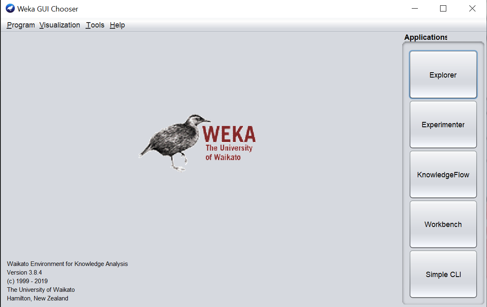

## Spuštění
* run-weka.bat (funguje mi to i ze start menu, ale asi jsem to instaloval?)
* varování package manageru (lze ignorovat, v tools jde stáhnout pluginy)
* režimy
    * explorer - standardní aplikace, využívá se na cvičení
    * experimenter - rozsáhlé dávky
    * knowledgeflow - grafický způsob práce
    * workbench - všechny pohledy


## Načtení prvního datasetu

* spustit Weku v režimu explorer
* v tabu Preprocess zvolit Open data

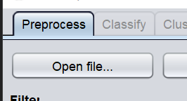

* vybrat `weather.numeric.arff` (mělo by se nacházet ve stejné složce, kde se nainstalovala Weka)

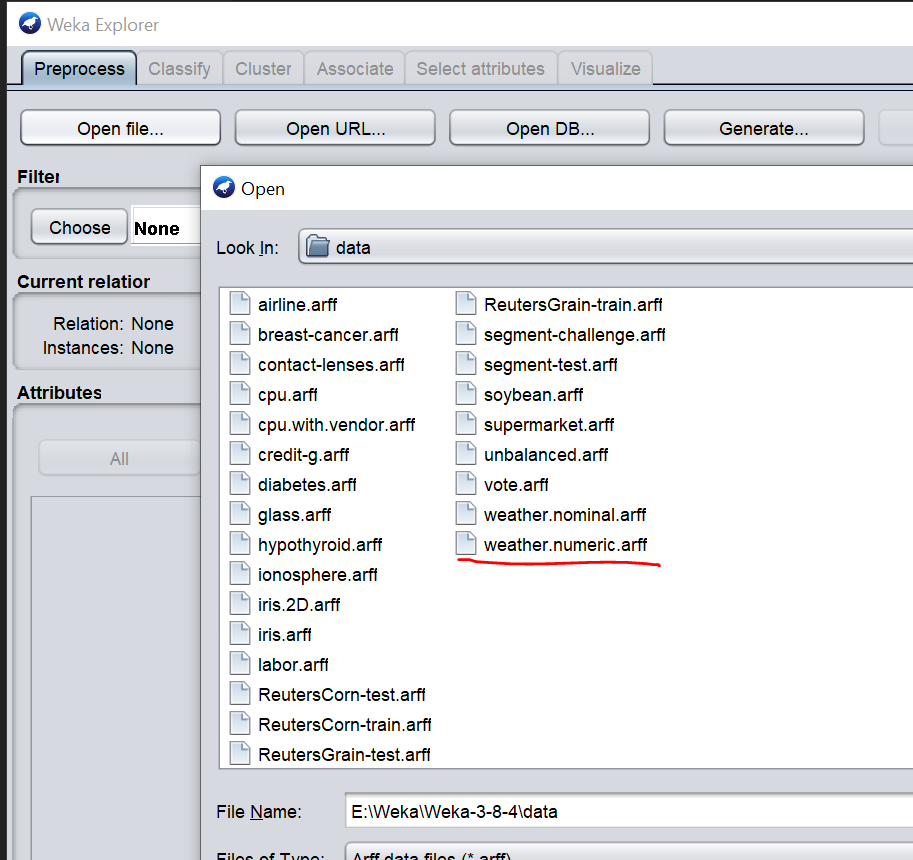

* po načtení se zobrazí informace o jednotlivých atributech (min, max...)
* graf pod - jednoduchá analýza závislosti mezi dvěma atributy

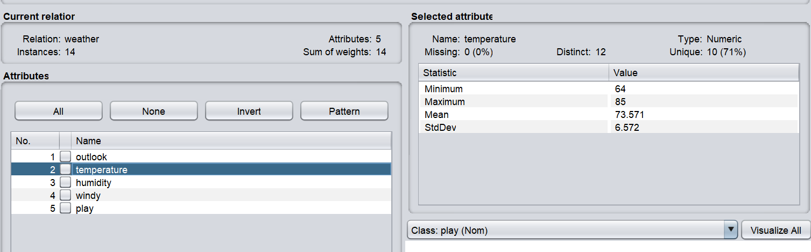

* zvolit tab classify
    * classifier - jednotlivé algoritmy
 

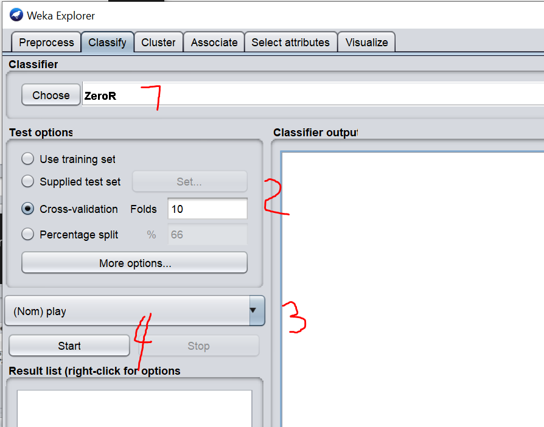
* classifier (1)
    * choose - vybere algoritmus
    * kliknutím do pole klasifikátoru otevře více
* test options - nastavení testů (2)
   * testuje na jiných datech než na kterých učíme - tedy nastavení testování
        * trénovací data - metodicky nevhodná
        * supplied test set - samostatný datový soubor
        * cross-validation - křížová validace, náhodné rozdělení do subsetů (doporučena pro malá data?)
        * percentage split - podíl vybraný jsou data pro **trénování**, zbytek pro *testování*
* výběr třídy (cílové proměnné)
* start - spustí trénování


## Výsledek 


(pozor, vyjdou jiná čísla - nastavil jsem tam špatně trénovací)

* nahoře - počet správně a špatně klasifikovaných případů
* confusion matrix - matice záměn, na hlavní diagonále jsou správně klasifikované entity

## Výběr algoritmu

* členěno podle skupin (rozhodovací stromy, neuronové sítě...)
* zašedlé - co není vhodné pro tento typ úlohy, např. lineární regrese nedává smysl pro kategorický atribut
* vybereme algoritmus OneRule - v detailu je vysvětlení parametrů
* OneRule vybere jeden nejvhodnější atribut, dle kterého se budeme rozhodovat
    * vybere vždy jedno pravidlo pro kategorii (lze vyčíst z vztahu mezi atributem outlook a třídou)


## Stromy
* vybereme algoritmus J48
* pustíme trénování
* pravým tlačítkem na J48 v seznamu "Result list" zvolíme Visualize tree

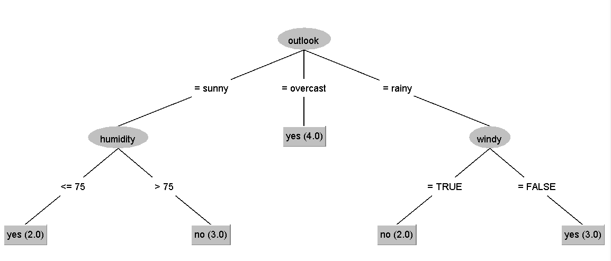

* vygenerovaný rozhodovací strom (ad overcast - odpovídá OneRule, protož to je nejlepší atribut pro rozhodnutí)

## Neuronová síť
* vybereme multilayer perceptron (ve functions)
* změníme parametr kliknutím do detailu
* nastavíme GUI na true
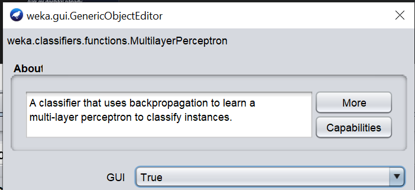

* Weka sama odhadne počet neuronů

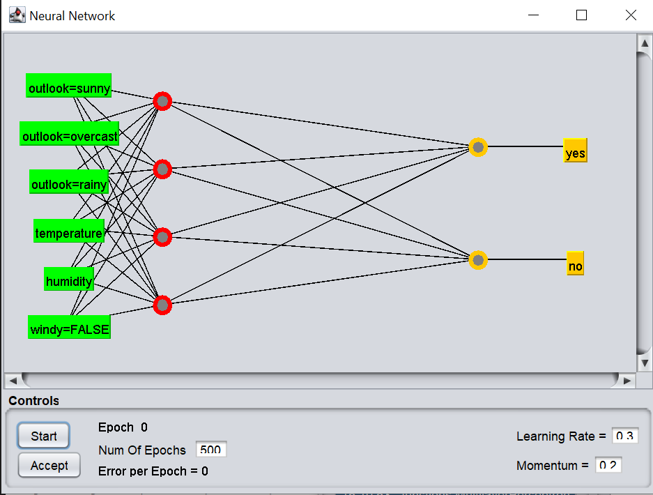

* start -> udělá model, accept -> potvrdíme, že algoritmus se nám líbí
* výsledek - opět bezchybný, ale obtížně pochopitelný (jednotlivá čísla - váhy vazeb)


## Zhodnocení modelů
* kvalita (správnost)
* srozumitelnost
* u těchto modelů je lepší strom (stejná přesnost, ale vyšší srozumitelnost)

## Bayes
* vybrat algoritmus Bayes -> NaiveBayes

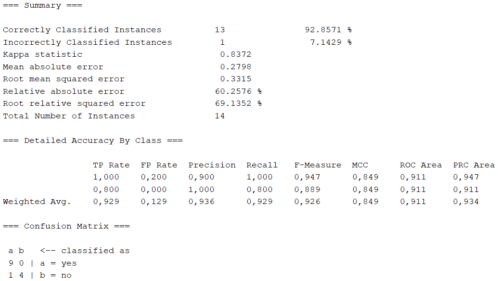

## Lazy
* vybereme IBk
* nejblizší sousedi nového případu
* v parametrech změníme na KNN 3 (vždy liché číslo)
* opět jedna chyba

## Cluster
* SimpleKMeans
* odstraníme atribut play
* počet clusterů (měl by být vyšší než počet tříd, ale ne příliš velký; určuje se primárně experimentálně) - zde dáme 3

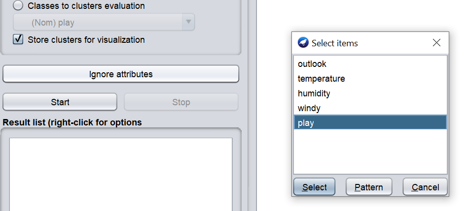

## Hledání asociací
* jen na kategoriální atributy
* ruzně si zaškrtám numerické atributy `temperature` a `humidity`
* kliknu na Remove

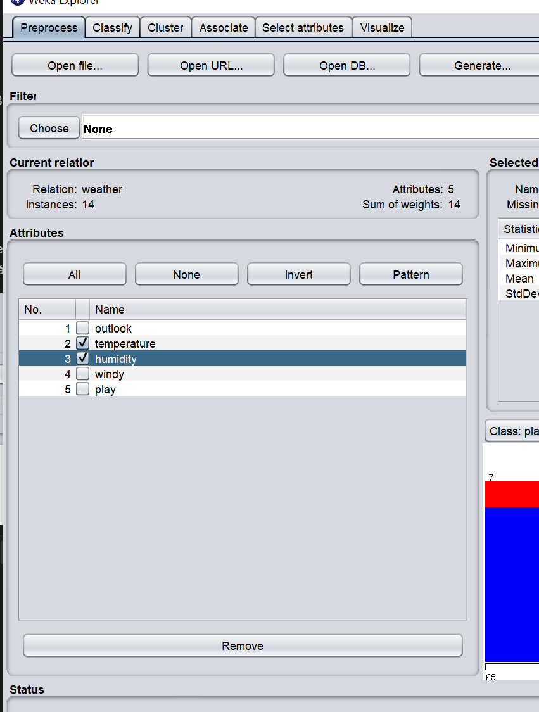
