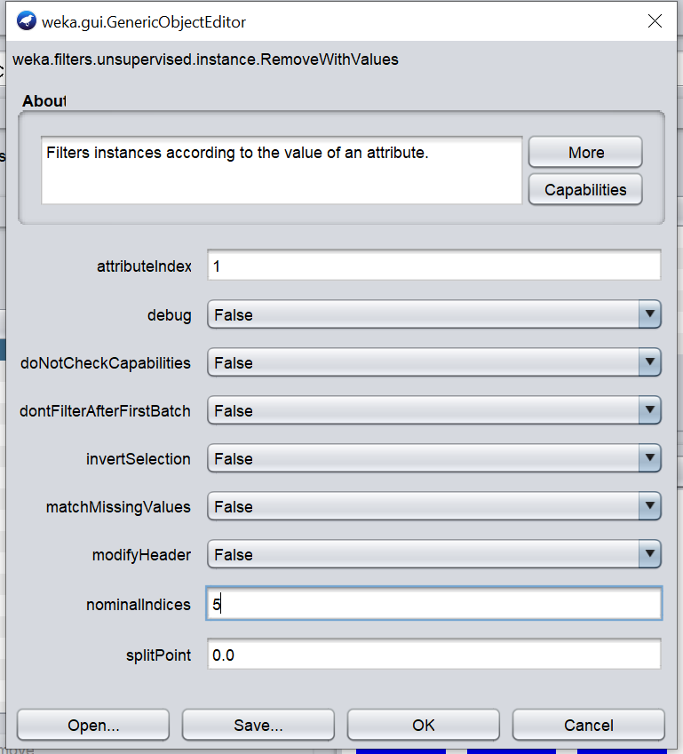
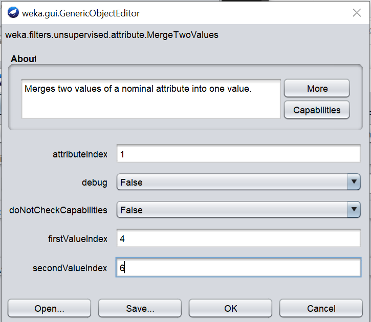
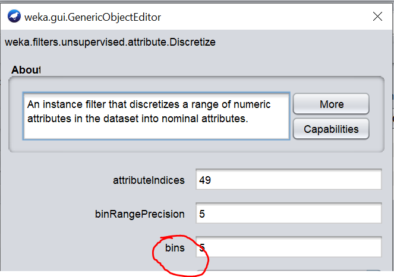

# Cvičení II.
* Weka filtry
    * např. chceme odstranit jen některá data (pacienti s kódem v KONSKUP = 6, konskup je první sloupeček, hodnota 6 má index 5)
    * Filters > Unsupervised > Remove with values
    
    * odstraním řádek dle prvního sloupce, kde hodnota má pátý index (je to kategorická proměnná)
    * invert selection - jestli se mají zahodit (False - zahodí, True - zahodíme všechny ostatní)
    * tlačítko Apply aplikuje filtr; upravený filtrovaný soubor lze uložit pomocí Save, Undo...
    * sloučení hodnot - unsupervised attribute - merge two values
    
    * merge many values - lze dát rozsah
    * diskretizace - unsupervised attribute - discretize; bins - počet
    ; use equal frequency - intervaly budou rovnoměrnější
    * nahrazení hodnot - unsupervised, attribute, ReplaceMissingvalues
    * attribute selection - vybere skupinu "nejlepších"; resample - vybalancuje a menší vzorek