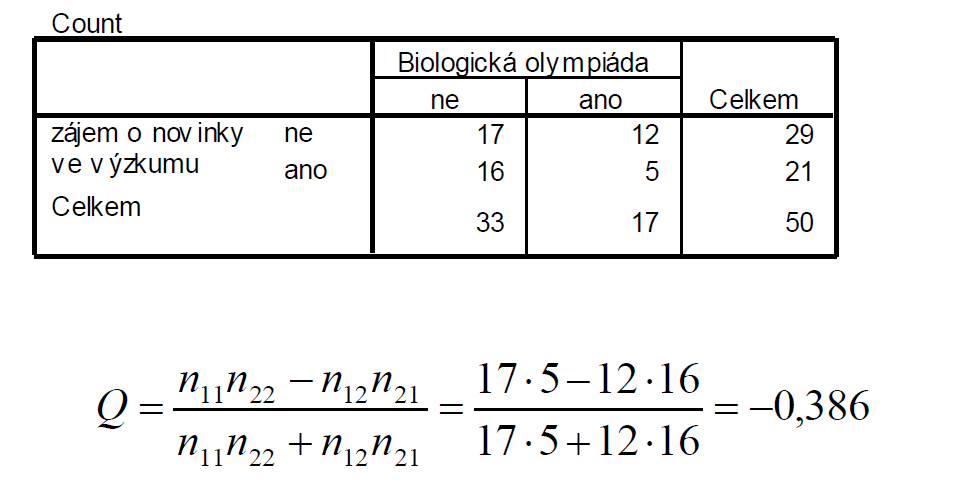

# Test
* nastavení vah -> Data, Weight cases by, vybrat proměnnou tlačítkem ">", zaklikne se automaticky weight cases by
## Fisherův exaktní test
* lze použít v případě, že nejsou splněny podmínky pro chí-kvadrát test
    * očekávané četnosti větší než 5
* nulová hypotéza
    * výběr ze základního souboru
    * relativní četnost 11 se rovná marginálním četnostím ze sloupečku a řádku 1 (1*1)
    * nulová hypotéza - nezávislost našich velkičin
    * alternativní - četnost je menší nebo větší než očekávaná
    * stačí obvykle tato, protože má 1 stupeň volnosti, marginální se nemění, ale když tam dosadíme hodnotu, tak je zbytek dán (tedy 1 stupeň volnosti, četnost se může lišit jen v jednom)
    * očekávaná v případě nezávislosti m11 = (n1+ * n+1) / n
        * formuluje se jako pravostranná (n11 > m11, H1: t11 > p1+*p+1)
        * formuluje se jako levostranná (n11 < m11, H1: t11 < p1+*p+1)
    * pozor - nesmíme překročit marginální četnosti v buňce
    * exaktní test - testujeme přímo p-hodnotu
        * zde součet pravděpodobností
        * součet 
    * p-hodnota pro boustrannou hypotézu
* v PSPP
    * soubor fisher.sav
    * analyze -> descriptive statistics, crosstabs (rowsd - radky, columns -> sloupce) -> ok
    * co nás zajímá -> exact sig. pro Fisher's exact test (možná bude potřeba scrollovat, je to docela dole :) )
    * oboustranná - two tailed
    * jestli je levostranná nebo pravostranná - záleží na definici nahoře
    * jak vypočítat, že v políčku (1,1) bude absolutní četnost 5 - PDF.HYPER()
        * Transform -> compute
        
        * první parametr - absolutní četnost, která nás zajímá (5)
        * druhý parametr - celkový počet (11)
        * zbytek - marginální četnosti (7 a 6)
        * ve variable view zvýšit počet desetinných míst
    * pak dát OK
* pokud je p-hodnota > 0,05 nezamítáme na hladině významnosti nulovou hypotézu o nezávislosti
## McNemarův test
* binomický test na shodu četností v políčkách na vedješí diagonále
* v rámci kontingenčních tabulek i neparametrických testů
* zajímá nás, jestli jsou stejné podíly
* nulová hypotéza - výběr z takového souboru, kde pí1,2 je stejná jako pí2,1
* alternativní - jako u binomického, oboustranná, pí1,2 =/= pí2,1
* pro oboustrnanou alternativní hypotézu se p hodnota spočte se jako dvojnásobek distribuční funkce
* pokud součet četností na diagonále > 25 tak lze použít aproximaci chí kvadrát rozdělení
* příklad
    * 
    * výpočet:
        * Binomické rozdělení [5; 0,5]
            * 0,5 - viz hypotéza
        * výsledek distribuční funkce F(1) = 0,1875
        * P-hodnota je dvojnásobek distribuční funkce, tedy 2F(1) = 0,375
        * význam 1?
    * s aproximací Chí-kvadrát
        * vyjde 7,934
        * což je 0,995 kvantil s jedním stupně hodnosti (konstantní pro čtyřpolní tabulku)
        * p-hodnota je 1-0,995 = 0,005
* v PSPP
    * samo o sobě není, ale lze vypočítat binomické rozdělení
    * případně v Analyze -> Non-parametric tests, 2 related samples, var1 řádky, var2 sloupce
        * zaškrtnout dole McNemar, ok
        * vychází správně :)
    * 2*CDF.BINOM(1,5,0.5) = 0,375
        * 1 - nižší z těch dvou četností
        * 5 - součet na diagonále
        * 0,5 - na ni testujeme četnosti
    * když 0,375 > 0,05 (hladina významnosti) tak nemůžeme zamítnout nulovou hypotézu
    * druhý příklad vychází 0,0044, 0,0044 < 0,05, zamítáme nulovou hypotézu ve prospěch alternativní hypotézy
* pokud platí alternativní hypotéza, tak říkáme, že se hodnota změnila
* např. názory před a po reklamou, jestli došlo ke změně (jestli nežádoucí usoudíme z tabulky :))
* když confidence interval obsahuje 1 -> na 5% hladině významnosti můžeme usoudit na závislost;

# Yuleho Q
* počítá se jako koeficient gamma, pro čtyřpolní tabulku se jen jmenuje takto, kdo ví proč
* 
* crosstabs, Gamma, Symmetric measures, Ordigan by Ordinal Gamma, -,39...
* zobrazuje se jako matice, je symetrická
* shluková hierarchická analýza
* rozsah -1 až 1, 1 perfektní pozitivní korelace (obě rostou spolu), -1 inverzní, 0 není asociace :)

# Yuleho Y
* stejné, jen tam jsou odmocniny

# Poměr šancí
* koeficient relativního rizika
    * sloupcová proměnná x1 / celkem v řádku, sloupcová proměnná x2 / celkem v druhém řádku
    * 
* interpretuje se, kolikrát je větší šance
    * poměr šancí v obrázku nahoře vychází 3,398
    * např. že absolventi FISu mají 3x větší šanci se uplatnit ve stejném oboru
* kde je závislost na chí-kvadrátu tak tam je i závislost poměru šancí
* Yuleho Q, Yuleho Y je funkcí poměru šancí
    * 
* PSPP
    * crosstabs, Risk
    * Odds ratio for řádek (1/2) -> value 3,40
    * lower, upper -> interval pro spolehlivost
    * pozor, zdá se, že ty intervaly vychází nějak nesmyslně
* závislost lze zjistit z chisq
    * asymptotic sig. 0,035 < 0,05, na 5 % hladině tedy zamítáme hypotézu o nezávislosti, tj. jsou závislé

nulová hypotéza - 
alternativní - 

0,028 < 0,05 zamítáme nulovou hypotézu jsou závislé 
0,028 > 0,01 nezamítáme nulovou hypotézu jsou nezávislé

0,054 > 0,05 zamítáme nulovou hypotézu jsou závislé 