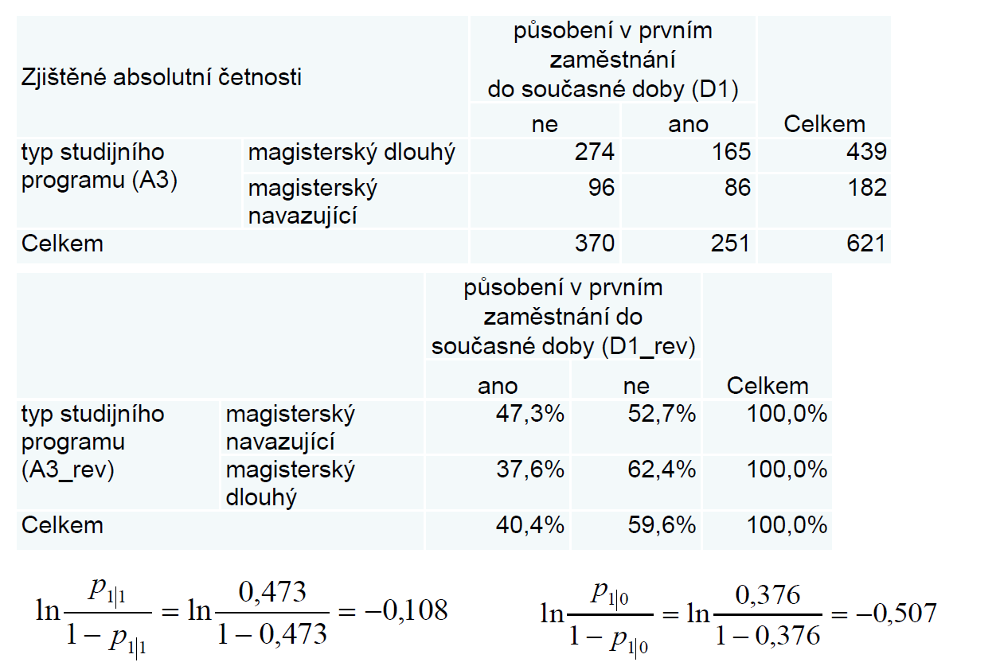

# Test
* logistická regrese
    * binární logistická regrese
        * binární vysvětlovaná proměnná Y
        * vysvětlující jak kategoriální (nominální) tak i kvantitativní
        * $\pi = P(Y = 1)$
            * pravděpodobnost že Y = 1?
        * šance $\frac{\pi}{1-\pi}$
        * logit $\ln\frac{\pi}{1-\pi}$
        * odhad pravděpodobnosti lze získat na základě $\pi = \frac{e^{{\beta_0} + {\beta_1}x_1...}}{1 + e^{{\beta_0} + {\beta_1}x_1...}}$
        * změna šancí nastoupení jevu
        * 
        * v Excel souboru
            * nevím proč, ale přehazovala řádky i sloupce u procent - sloupce proto aby to šlo (aby tam byla kladná proměnná)
* multinomická logistická regrese
    * vysvětlovaná nominální s více než dvěma kategoriemi
    * vysvětlovaná proměnná má 3 kategorie
    * vysvětlující jak kategoriální (nominální) tak i kvantitativní
    * X nabývá 3 kategorií $z_1 = 1$ pro $x=1$ a $z_2 = 1$ pro $x=2$, jinak $z_j = 0$
    * rozdělíme na dvě kontingenční tabulky
    * např. žádný a malý přínos, střední přínos a velký přínos
    * dělají se dvě kontigenční tabulky - vždy jedna stejná kategorie
* vztah mezi parametrem ($\beta_0 = \ln{\frac{p_{1|0}}{1-p_{1|0}}}$ a $\beta_1 = \ln{\frac{p_{1|1}}{1-p_{1|1}}}$)
* p1,1 = první řádek, p1,0 = druhý řádek
* zkoumáme jen pro první sloupečkovou kategorii (ta by měla být pozitivní - teda ano)
* proměnné se nemusí překódovávat, SPSS to umí samo

* v ZT je otázka i na diskriminační analýzu, vysvětlovaná obecně nominální, vysvěltující pouze kvantitativní