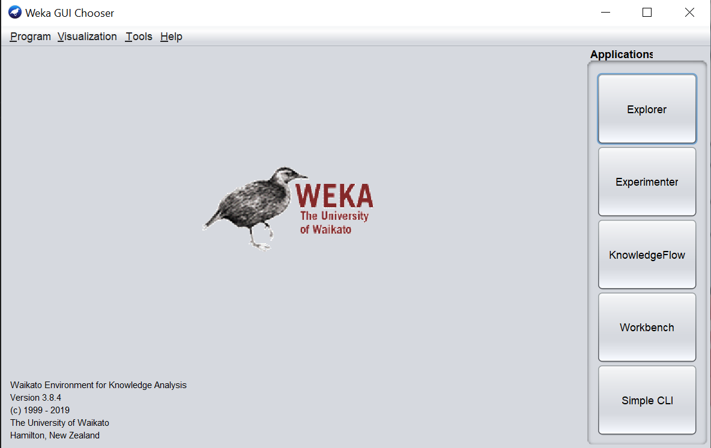
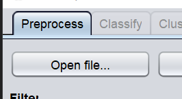
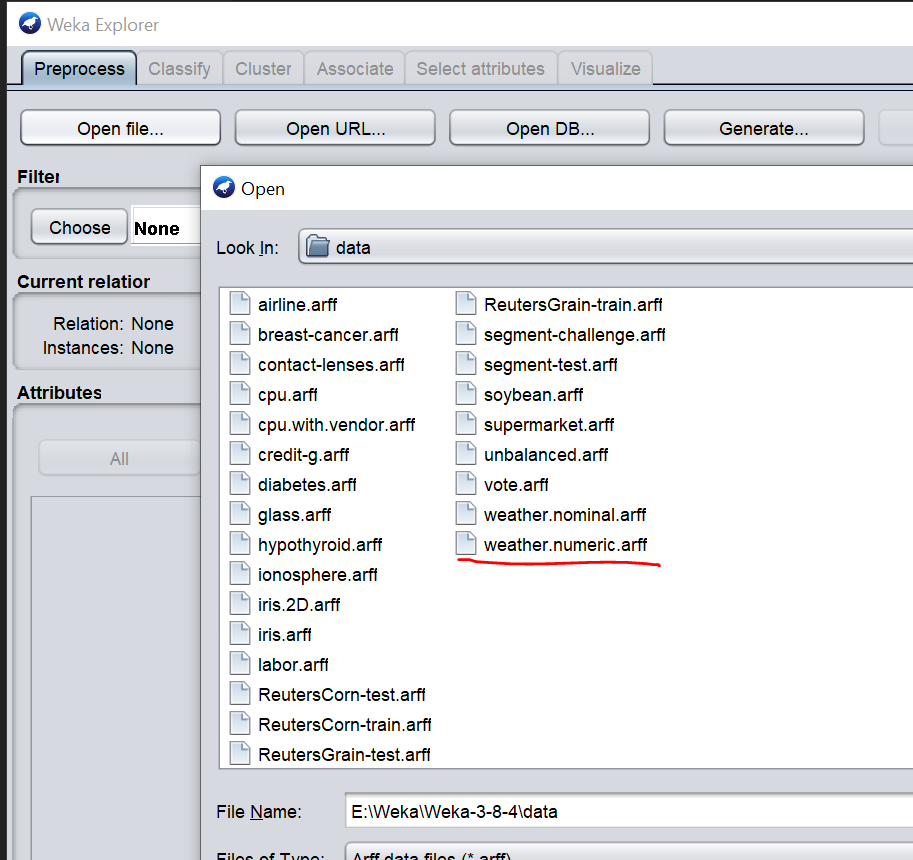

# Cvičení I.

* adresářová struktura

```
\
\data\ # obsahuje datové soubory arff
\doc\  # programátorská dokumentace
```

## .arff
* metadata (atribut, rozsah/datový typ)
* data
* nutně obsahuje cílový atribut
* komentáře %

## Weka



## Spuštění
* run-weka.bat (funguje mi to i ze start menu, ale asi jsem to instaloval?)
* varování package manageru (lze ignorovat, v tools jde stáhnout pluginy)
* režimy
    * explorer - standardní aplikace, využívá se na cvičení
    * experimenter - rozsáhlé dávky
    * knowledgeflow - grafický způsob práce
    * workbench - všechny pohledy


## Načtení prvního datasetu

* spustit Weku v režimu explorer
* v tabu Preprocess zvolit Open data



* vybrat `weather.numeric.arff` (mělo by se nacházet ve stejné složce, kde se nainstalovala Weka)

